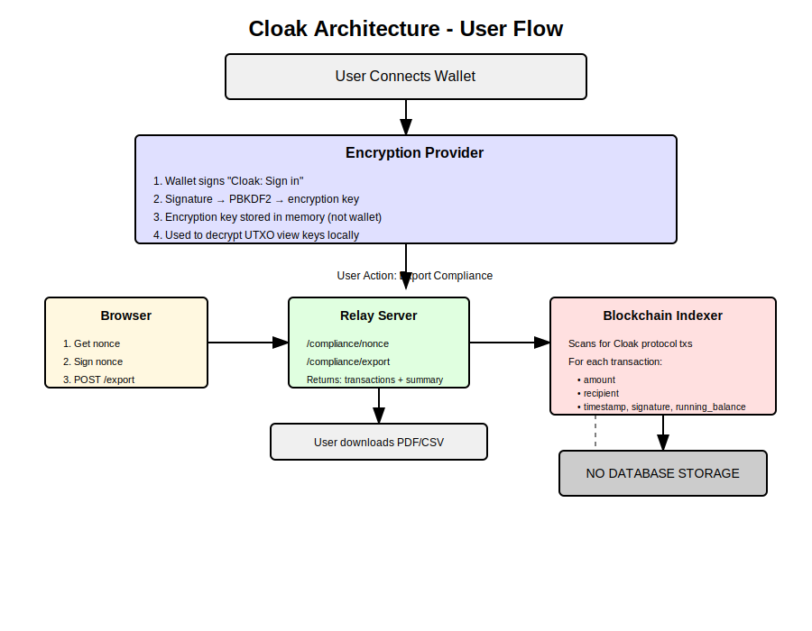
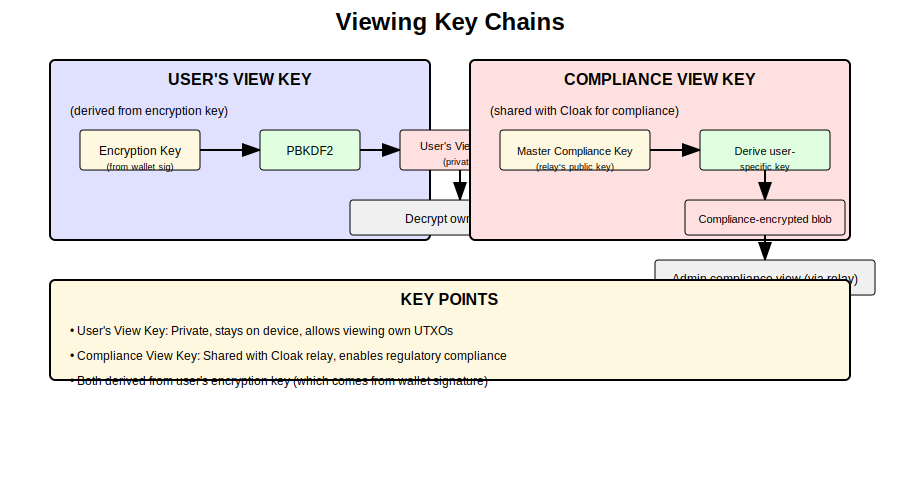
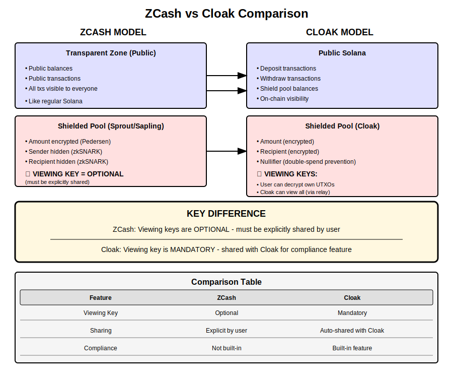

# Cloak Viewing Keys & Compliance Architecture

## Overview

Cloak uses viewing keys to enable users to view their own private transactions while also providing compliance capabilities for regulatory oversight. This document explains the architecture, how it compares to ZCash, and the data flow.

---

## User Flow: From Wallet Connection to Compliance Export

### Step 1: Wallet Connection & Encryption Key Derivation

When a user connects their wallet, the following happens:

1. **Wallet Signs Message**: The user's wallet signs `"Cloak: Sign in"` message
2. **Key Derivation**: The signature is processed through PBKDF2 to derive an encryption key
3. **Local Storage**: The encryption key is stored in memory (NOT in the wallet)
4. **View Key Access**: The key is used to decrypt UTXO view keys locally

### Step 2: Compliance Export

When a user wants to export their compliance history, the data flows through:

1. **Browser** → Gets nonce, signs it, POSTs to relay
2. **Relay Server** → Validates signature, queries indexer
3. **Blockchain Indexer** → Scans for Cloak protocol transactions
4. **Result** → Returns transactions + summary (PDF/CSV download)

**Important**: No database storage - all data is computed on-demand from the blockchain.

---

## Architecture Diagram



---

## Viewing Keys Explained

Cloak has two types of viewing keys:

### 1. User's View Key

The user's view key is derived from their encryption key and allows them to decrypt and view their own UTXOs (private balance).

- **Encryption Key** (from wallet signature) → **PBKDF2** → **User's View Key** (private)
- Enables: Decrypt own UTXOs to view private balance

### 2. Compliance View Key

The compliance view key is shared with Cloak (the relay) to enable compliance and regulatory features. This is **mandatory** - every user's transactions are viewable by Cloak for compliance purposes.

- **Master Compliance Key** (relay's public key) → **Derive user-specific key** → **Compliance-encrypted blob**
- Enables: Admin compliance view via relay API

---

## Viewing Keys Diagram



---

## ZCash Comparison

### ZCash Model

In ZCash, there are two zones:

1. **Transparent Zone**: Like regular public blockchains - all balances and transactions are publicly visible
2. **Shielded Pool (Sprout/Sapling)**: Uses advanced cryptography (zkSNARKs) to hide:
   - Amount (encrypted with Pedersen commitments)
   - Sender (hidden)
   - Recipient (hidden)

**Viewing Keys in ZCash are OPTIONAL** - users must explicitly share their viewing key if they want someone else to see their transactions.

### Cloak Model

Cloak operates similarly to ZCash's shielded pool:

1. **Public Solana**: Deposit and withdraw transactions are visible on-chain
2. **Shielded Pool**: Amount and recipient are encrypted

---

## ZCash vs Cloak Diagram



---

## Data Sources

### Where Does Compliance Data Come From?

The compliance data is **NOT stored in any database**. Instead, it is **computed on-demand from the blockchain**.

The relay server:

1. **Indexes the blockchain** for Cloak protocol transactions (deposits/withdrawals to the shield pool)
2. **For each transaction, extracts**:
   - `commitment` - the merkle tree leaf
   - `amount` - from on-chain data
   - `recipient` - decoded from the transaction
   - `timestamp` - from block time
   - `signature` - the actual on-chain transaction signature
   - `tx_type` - deposit or withdraw
3. **Computes running balance** by processing all transactions chronologically

### Example Response

```json
{
  "success": true,
  "data": {
    "user_pubkey": "DHbBTmKiS1wqZszbu1VRPMVsFHTMWNfCRdyQt8ZJu1J1",
    "transactions": [
      {
        "commitment": "285330e1c7136c5338c0f7bee2f73a62b05967a5ea9d1bb90531d98253fd5bb0",
        "amount": 12500000000,
        "recipient": "self",
        "timestamp": 1771290318152,
        "tx_type": "deposit",
        "signature": "gmS4waEwq5KZNMsA1qhnMGMMBiwnB8eti7eFR96FeftM4sZU2hFx9QYjFV8B21v...",
        "running_balance": 12500000000
      }
    ],
    "summary": {
      "total_deposits": 75000000000,
      "total_withdrawals": 49570907809,
      "net_change": 25429092191,
      "transaction_count": 18,
      "final_balance": 25429092191
    }
  }
}
```

The signatures are real Solana transaction signatures that exist on-chain.

---

## Summary

| Aspect | Description |
|--------|-------------|
| **Encryption Key** | Derived from wallet signature, stored in memory |
| **User's View Key** | Allows user to view their own private balance |
| **Compliance View Key** | Shared with Cloak for regulatory compliance |
| **Data Storage** | None - computed from blockchain on-demand |
| **ZCash Difference** | Viewing keys are optional in ZCash, mandatory in Cloak |
| **Compliance Access** | Requires admin wallet signature to query |
