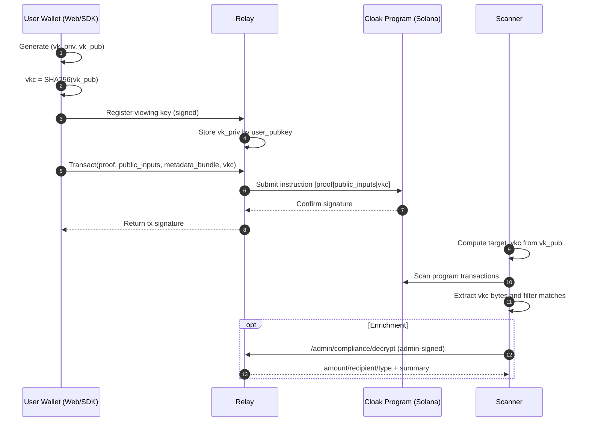

# Cloak Viewing Key Flow and Cloak vs Zcash

## 1) Cloak Viewing-Key and Compliance Flow

### System Diagram

```mermaid
flowchart LR
  subgraph Client[Client (Web / SDK)]
    U[User Wallet]
    VK[Viewing Key Pair\nX25519]
    SC[Chain Scanner]
  end

  subgraph Relay[Relay Service]
    VKR[/POST /viewing-key/register/]
    TX[/POST /transact/]
    DEC[/POST /admin/compliance/decrypt/]
    EXP[/POST /admin/compliance/export/]
    DB[(Postgres\nviewing_keys\ntransaction_metadata)]
  end

  subgraph Chain[Solana]
    PROG[Cloak Program]
    ON[(On-chain Instructions)]
  end

  U --> VK
  U -->|sign CLOAK_VIEWING_KEY_{user}| VKR
  VKR --> DB

  U -->|proof + public_inputs + metadata_bundle + viewing_key_commitment| TX
  TX -->|instruction: [proof|public_inputs|vkc]| PROG
  PROG --> ON

  SC -->|compute SHA256(vk_public)| SC
  SC -->|scan Cloak txs + match vkc| ON

  DEC --> DB
  EXP --> DB
  U -->|admin wallet signature| DEC
  U -->|admin wallet signature| EXP
```

### Transaction Sequence



## 2) Cloak (Entire System) vs Zcash

| Dimension | Cloak | Zcash |
|---|---|---|
| Base architecture | Solana program + relay services + client SDK/web | Native L1 blockchain protocol |
| Private state model | UTXO-like commitments/nullifiers in program logic | Shielded note commitments/nullifiers in protocol |
| Proof integration | Groth16 proof bytes carried in Solana instruction payloads | Shielded proofs integrated in Zcash tx formats |
| Viewing-key role | X25519 viewing key for encrypted metadata; chain-discovery marker via `SHA256(vk_public)` commitment | Viewing keys are protocol/wallet-native for shielded disclosure/scanning |
| Chain discovery method | Scan instructions for matching 32-byte `viewing_key_commitment` | Scan/decrypt shielded outputs and notes from chain data |
| On-chain data for visibility | Lightweight marker only (32-byte commitment), no viewing key | Protocol-defined shielded payload structures |
| Compliance data access | Relay decrypt/export APIs (`/admin/compliance/decrypt`, `/admin/compliance/export`, `/compliance/export`) | No built-in centralized compliance API; wallet/tooling driven |
| Data enrichment path | Optional relay metadata join for amount/recipient/type details | Detail recovery is note/ciphertext-driven in shielded model |
| Operational dependency | Relay currently central to metadata retention and compliance UX | Core shielded usage is node/wallet centric |
| Key custody pattern (current Cloak flow) | Relay stores user viewing private key after signed registration | Viewing/spending keys typically remain wallet-controlled |
| Performance/data tradeoff | Smaller on-chain footprint, richer context off-chain | More protocol-level shielded payload semantics on-chain |
| Admin workflow | Explicit admin-wallet signature gate (`CLOAK_ADMIN_{target}`) | Governance/compliance workflows external to base protocol APIs |

## 3) Practical Interpretation

- Cloak is aligned with Zcash at the **privacy objective level** (shielded transfers + selective visibility).
- Cloak differs at the **systems architecture level**: Solana program + relay-assisted compliance and exports.
- Cloak’s viewing-key commitment model prioritizes compact on-chain footprint and fast scan filtering, with optional relay enrichment for detailed reporting.

## 4) Migration Plan: Remove `transaction_metadata` Dependency

### Goal

Make chain scanning + decryption sufficient for user history, with relay metadata becoming optional acceleration only.

### Phase 1 (started)

- Keep current tx format compatibility.
- Add optional chain-native encrypted note payload envelope to `transact` instruction tail (after viewing key commitment).
- Keep relay DB paths intact for backward compatibility.

Implemented in code:

- Relay now accepts `encrypted_notes` (base64 list) on `POST /transact` and validates size limits.
- Relay embeds notes into instruction data as envelope `CLVK|version|count|[len+note]*`.
- SDK `transact` now supports `encryptedNotes?: string[]` for passing chain notes.
- Scanner now detects and reports chain note envelope count on matched transactions.

### Phase 2

- SDK/Web: produce compact encrypted chain notes by default via `chainNoteViewingKeyPublic`.
- Add scanner/decryptor path that takes viewing key secret and decrypts chain notes directly.
- Derive tx semantics from chain + decrypted notes first; use relay enrichment only as fallback.

Implemented pieces:

- `sdk/src/core/chain-note.ts` adds compact encrypted note encoding (small enough for Solana tx limits).
- `sdk/scripts/scan-chain-notes.ts` decrypts chain notes from transactions using viewing key private key.
- `sdk/scripts/export-chain-compliance.ts` reconstructs compliance CSV directly from chain notes (no relay metadata required).

### Phase 3

- Move compliance export to chain-first reconstruction.
- Mark `transaction_metadata` as optional cache/index.
- Add migration flag to disable metadata writes without breaking older clients.

### Phase 4

- Remove hard dependency on relay metadata for history/compliance.
- Keep relay endpoints for convenience and export formatting only.
