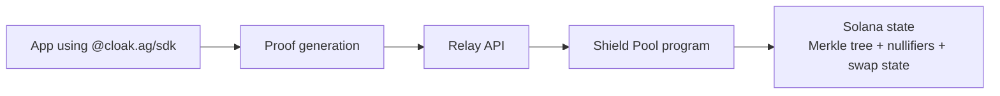

Cloak is split into three layers:

- `sdk/` TypeScript client for proof generation and transaction orchestration
- `programs/shield-pool/` on-chain verifier + state machine
- `services/relay/` job queue and transaction execution service

## High-level flow

## Execution modes

There are two active SDK patterns:

1. Note API (`CloakSDK`)
2. UTXO API (`transact`, `transfer`, `swapUtxo`, ...)

Both rely on the same on-chain invariants:

- Groth16 proof verification
- Nullifier uniqueness (double-spend prevention)
- Merkle root membership checks
- Amount conservation and fee enforcement

## On-chain state

The program maintains:

- Merkle tree (`MERKLE_TREE_HEIGHT = 32`)
- Root history ring (`ROOT_HISTORY_SIZE = 100`)
- Nullifier PDAs (`["nullifier", nullifier_hash]`)
- Pool/Treasury PDAs
- SwapState PDAs for two-phase swaps

## Relay role

The relay provides:

- `POST /withdraw` (note-based withdraw + optional swap)
- `POST /transact` (UTXO transact)
- `POST /transact_swap` (UTXO transact + swap intent)
- `GET /status/:id` for async job tracking
- Merkle helpers (`/commitments`, `/merkle-root`)

For large activity bursts, stale roots are expected occasionally. SDK and relay flows include retry logic for `RootNotFound` (`0x1001`).

## Program IDs

`programs/shield-pool/src/lib.rs` defines:

- Mainnet build: `c1oak6tetxYnNfvXKFkpn1d98FxtK7B68vBQLYQpWKp`
- Development build: `3EvH6XYQir7D2RyzCdP7QFmJFfSPfdeoB8VnpLdEF4Kr`

If you use devnet/development deployments, set `programId` explicitly in the SDK.
