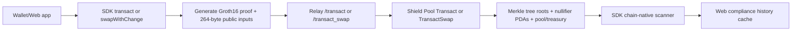

Cloak is a UTXO privacy system on Solana with five active runtime surfaces:

- `web/` wallet UX, encrypted local cache, and scan/export flows
- `sdk/` proof generation, transaction orchestration, chain-note scan/decrypt
- `services/relay/` API for submit/status/viewing-key registration and chain indexing
- `programs/shield-pool/` on-chain proof verifier + state machine
- `packages/circuits/` Circom constraints (2-in/2-out transaction circuit)

## End-to-end flow

```mermaid
flowchart LR
  A[Wallet/Web app] --> B[SDK transact or swapWithChange]
  B --> C[Generate Groth16 proof + 264-byte public inputs]
  C --> D[Relay /transact or /transact_swap]
  D --> E[Shield Pool Transact or TransactSwap]
  E --> F[Merkle tree roots + nullifier PDAs + pool/treasury]
  F --> G[SDK chain-native scanner]
  G --> H[Web compliance history cache]
```

## Core transaction model

- The canonical path is UTXO `transact` / `transact_swap` (2 inputs, 2 outputs, tree height 32).
- Public inputs are `264` bytes: `root[32] + publicAmount[8] + extDataHash[32] + mint[32] + nullifiers[64] + commitments[64] + chainNoteHash[32]`.
- `publicAmount` meaning:
  - `> 0`: deposit into pool
  - `< 0`: withdrawal from pool
  - `= 0`: shield-to-shield transfer
- The same proof/public-input shape is consumed by relay and on-chain program.

## Fee model (gross, fee, net)

- Fixed fee: `5_000_000` lamports
- Variable fee: `gross * 3 / 1000`
- Total fee: `fixed + variable`
- Net recipient amount: `gross - fee`
- Minimum deposit: `10_000_000` lamports

These constants are aligned in:

- `programs/shield-pool/src/constants.rs`
- `sdk/src/utils/fees.ts`
- `services/relay/src/fee_constants.rs`

## On-chain state

`programs/shield-pool` maintains:

- Merkle tree (`MERKLE_TREE_HEIGHT = 32`)
- Root history ring (`ROOT_HISTORY_SIZE = 100`)
- Nullifier PDAs (`["nullifier", nullifier_hash]`) for spent checks
- Pool PDA (`["pool"]`) and Treasury PDA (`["treasury"]`)
- SwapState PDA (`["swap_state", pool_pubkey, nullifier]`) for two-phase swaps

## Relay responsibilities

- Accept submit requests (`/transact`, `/transact_swap`, legacy `/withdraw`)
- Validate payload size/shape and queue status tracking (`/status/:id`)
- Provide chain-index data (`/commitments`, `/merkle-root`)
- Run background commitment sync into Postgres for fast Merkle reconstruction
- Verify and store viewing keys (`/viewing-key/register`)
- Offer admin compliance endpoints (`/admin/compliance/*`)

`GET /risk-quote` intentionally returns `501` in relay; deposits that require risk oracle quotes must use an external quote service or `getRiskQuoteInstruction` in SDK options.

## Viewing keys and history scanning

- Viewing-key registration is required for normal SDK/web flows before transact/deposit/withdraw/swap.
- User signs a fixed sign-in message; relay verifies signature and stores the 32-byte viewing key with an identifier hash.
- Scanner path is chain-native: SDK reads program transactions from RPC, decrypts compact chain notes with `nk`, verifies `chainNoteHash` integrity, and computes running balance/fees.
- Web history uses encrypted local cache (`cloak_compliance_*`) and supports explicit `Clear cache & rescan`.

## Program IDs

`programs/shield-pool/src/lib.rs` currently defines:

- `c1oak6tetxYnNfvXKFkpn1d98FxtK7B68vBQLYQpWKp` (default)

If you deploy a local/dev build with a different address, pass that `programId` explicitly to SDK/web.
