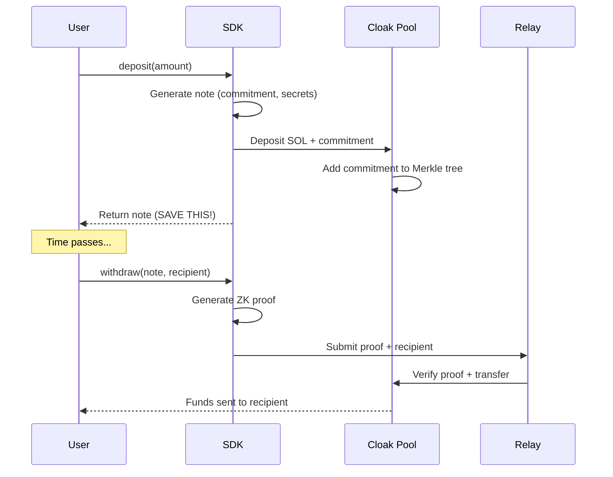

This guide explains the cryptographic primitives and data structures that power Cloak's privacy features. Understanding these concepts helps you build secure applications and debug issues effectively.

## The privacy model

Cloak uses a **deposit-withdraw** pattern but optimized for Solana:



**Key insight**: The deposit transaction contains only a cryptographic commitment. The withdrawal transaction contains only a zero-knowledge proof and recipient. There's no on-chain link between them.

## Cloak notes

A **note** is a JSON object containing all secrets needed to withdraw deposited funds:

```typescript
interface CloakNote {
  version: string;        // Protocol version ("2.0")
  amount: number;         // Amount in lamports
  commitment: string;     // Poseidon hash (hex, 64 chars)
  sk_spend: string;       // Spending key (hex, 64 chars)
  r: string;              // Randomness (hex, 64 chars)
  timestamp: number;      // Creation time (Unix ms)
  network: Network;       // "devnet" | "mainnet"
  
  // Set after deposit:
  depositSignature?: string;
  leafIndex?: number;
  root?: string;
  merkleProof?: MerkleProof;
}
```

<Warning>
**The note is your access key.** Anyone with the note can withdraw the funds. Treat it like a private key:

- Never log notes in production
- Store in encrypted storage
- Never transmit over insecure channels
</Warning>

### Commitment calculation

The commitment is a Poseidon hash of the amount and secrets:

```
commitment = Poseidon(amount, r, sk_spend)
```

This creates a unique fingerprint that:
- Commits to the exact amount
- Cannot be reversed to reveal the secrets
- Can be proven with a ZK proof

```typescript
import { computeCommitment } from "@cloak.ag/sdk";

const commitment = await computeCommitment(
  BigInt(amount),
  BigInt("0x" + r),
  BigInt("0x" + sk_spend)
);
```

## Merkle tree

All commitments are stored in an on-chain Merkle tree. This enables efficient membership proofs:

```
                    Root
                   /    \
              H01          H23
             /   \        /   \
           H0    H1     H2    H3
          /  \  /  \   /  \  /  \
         C0 C1 C2 C3  C4 C5 C6 C7
         
         ^ Your commitment at leaf index 0
```

### Merkle proofs

To withdraw, you prove your commitment exists in the tree without revealing which one:

```typescript
interface MerkleProof {
  pathElements: string[];  // Sibling hashes
  pathIndices: number[];   // Path directions (0=left, 1=right)
  root: string;            // Tree root at proof time
}
```

The SDK computes proofs directly from on-chain state—no external indexer required:

```typescript
// SDK handles this internally via computeProofFromChain()
const proof = await sdk.getMerkleProof(connection, note.leafIndex);

// Or use the lower-level utility directly
import { computeProofFromChain } from "@cloak.ag/sdk";
const chainProof = await computeProofFromChain(connection, merkleTreePDA, leafIndex);
```

<Tip>
The Cloak protocol stores the last 100 Merkle roots on-chain. This gives you a ~30-minute window to complete withdrawals even during high deposit activity.
</Tip>

## Nullifiers

A **nullifier** prevents double-spending. It's derived from the note secrets:

```
nullifier = Poseidon(sk_spend, leaf_index)
```

When you withdraw:
1. The ZK proof includes the nullifier
2. The on-chain program checks if the nullifier was used before
3. If new, the nullifier is stored and the withdrawal proceeds
4. If already used, the transaction fails

```typescript
import { computeNullifierAsync } from "@cloak.ag/sdk";

const nullifier = await computeNullifierAsync(note.sk_spend, note.leafIndex);
```

<Note>
Nullifiers are deterministic. Given the same note, you always compute the same nullifier. This is why each note can only be spent once.
</Note>

## Zero-knowledge proofs

Cloak uses **Groth16** proofs generated from Circom circuits. The proof demonstrates:

1. **Membership**: Your commitment exists in the Merkle tree
2. **Ownership**: You know the secrets (sk_spend, r) that produce the commitment
3. **Nullifier validity**: The nullifier is correctly derived
4. **Amount consistency**: The output amounts match the input (minus fees)

All without revealing:
- Which commitment you're spending
- The secret values
- The connection between deposit and withdrawal

### Proof generation

The SDK handles proof generation automatically:

```typescript
// Withdrawal triggers proof generation internally
const result = await sdk.withdraw(connection, note, recipient, {
  onProgress: (status) => {
    if (status === "proof_generating") {
      console.log("Generating ZK proof...");
    }
  },
});
```

<Info>
Proof generation takes 2-5 seconds depending on hardware. The circuits are loaded from `/circuits` in browser environments or `CIRCUITS_PATH` in Node.js.
</Info>

## Key hierarchy (v2.0)

Cloak v2.0 introduces a hierarchical key structure for advanced features:

```
Master Seed (32 bytes)
    |
    └─→ Spend Key (sk_spend)
            |
            └─→ View Key (vk_secret, pvk)
```

### Key types

<ResponseField name="Master seed" type="Uint8Array">
The root secret from which all other keys derive. Store this securely—it can regenerate all keys.
</ResponseField>

<ResponseField name="Spend key" type="SpendKey">
Used in commitment calculations. Required to withdraw funds.

<Expandable title="Properties">
  <ResponseField name="sk_spend" type="Uint8Array">
  32-byte private spending key.
  </ResponseField>
  
  <ResponseField name="pk_spend" type="Uint8Array">
  32-byte public spending key (derived from sk_spend).
  </ResponseField>
</Expandable>
</ResponseField>

<ResponseField name="View key" type="ViewKey">
Enables note scanning without spending authority. Safe to share with watch-only services.

<Expandable title="Properties">
  <ResponseField name="vk_secret" type="Uint8Array">
  32-byte secret for decrypting incoming notes.
  </ResponseField>
  
  <ResponseField name="pvk" type="Uint8Array">
  32-byte public view key. Others use this to encrypt notes for you.
  </ResponseField>
</Expandable>
</ResponseField>

### Generating keys

```typescript
import { generateCloakKeys, exportKeys, importKeys } from "@cloak.ag/sdk";

// Generate new key hierarchy
const keys = generateCloakKeys();

// Export for backup (contains secrets!)
const backup = exportKeys(keys);
console.log(backup);

// Import from backup
const restored = importKeys(backup);
```

### Note storage

<Warning>
Note scanning via the SDK has been removed. For better privacy, users should maintain their own local note storage rather than relying on indexer-stored encrypted outputs.
</Warning>

The recommended approach is to persist notes locally using the `onNoteGenerated` callback:

```typescript
// Save notes during deposit
const result = await sdk.deposit(connection, amount, {
  onNoteGenerated: async (note) => {
    // Persist to your secure storage
    await saveNoteToLocalStorage(note);
  },
});

// Load and manage notes from your storage
const notes = await loadNotesFromStorage();
const withdrawableNotes = notes.filter(note => sdk.isWithdrawable(note));
```

<Note>
Note storage is handled locally by your application. Store notes securely using the SDK's storage adapters or your own encrypted storage solution.
</Note>

## Outputs hash

For multi-recipient withdrawals, outputs are committed in a single hash:

```
outputs_hash = Poseidon(
  addr1_lo, addr1_hi, amount1,
  addr2_lo, addr2_hi, amount2,
  ...
)
```

This ensures the ZK proof commits to specific recipients and amounts:

```typescript
import { computeOutputsHashAsync } from "@cloak.ag/sdk";

const outputsHash = await computeOutputsHashAsync([
  { recipient: address1, amount: 50_000_000 },
  { recipient: address2, amount: 47_000_000 },
]);
```

## Swap outputs hash

For token swaps, the hash includes swap-specific fields:

```
swap_outputs_hash = Poseidon(
  input_mint_lo, input_mint_hi,
  output_mint_lo, output_mint_hi,
  recipient_ata_lo, recipient_ata_hi,
  min_output_amount,
  input_amount
)
```

```typescript
import { computeSwapOutputsHashAsync } from "@cloak.ag/sdk";

const swapHash = await computeSwapOutputsHashAsync(
  inputMint,
  outputMint,
  recipientAta,
  minOutputAmount,
  inputAmount
);
```

## Protocol fees

Every withdrawal incurs fees collected by the protocol:

| Fee | Calculation | Purpose |
|-----|-------------|---------|
| Fixed | 0.005 SOL | Relay gas costs |
| Variable | 0.3% of amount | Protocol revenue |

```typescript
import { 
  calculateFee, 
  getDistributableAmount,
  FIXED_FEE_LAMPORTS,     // 5_000_000
  VARIABLE_FEE_RATE       // 0.003
} from "@cloak.ag/sdk";

const deposited = 100_000_000; // 0.1 SOL

// Calculate total fee: 5_000_000 + 300_000 = 5_300_000
const fee = calculateFee(deposited);
console.log("Fee:", fee, "lamports");

// Get amount after fees: ~94_700_000
const distributable = getDistributableAmount(deposited);
console.log("Distributable:", distributable, "lamports");
```

## Next steps

<CardGroup cols={2}>
<Card title="API reference" icon="code" href="/sdk/api-reference">
Complete method documentation with type definitions.
</Card>

<Card title="Wallet integration" icon="wallet" href="/sdk/wallet-integration">
Integrate with React and wallet adapters.
</Card>
</CardGroup>

