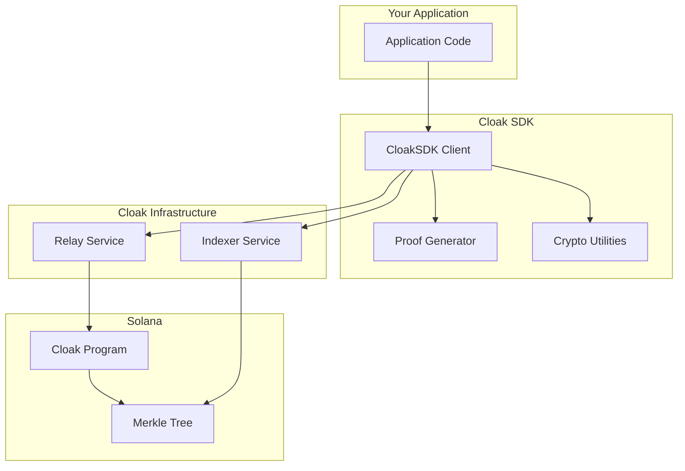

The Cloak SDK provides a complete TypeScript solution for integrating private transactions into your Solana applications. Using zero-knowledge proofs, your users can deposit, transfer, and swap SOL without exposing transaction details on-chain.

<CardGroup cols={2}>
<Card title="Quickstart" icon="rocket" href="/sdk/quickstart">
Get started with your first private transaction in under 5 minutes.
</Card>

<Card title="Core concepts" icon="lightbulb" href="/sdk/core-concepts">
Understand notes, commitments, and the privacy model.
</Card>

<Card title="React integration" icon="react" href="/sdk/wallet-integration">
Integrate with wallet adapters in React and Next.js applications.
</Card>

<Card title="API reference" icon="code" href="/sdk/api-reference">
Complete SDK method documentation with examples.
</Card>
</CardGroup>

## Key features

<AccordionGroup>
<Accordion title="Private transfers with ZK proofs">
Send SOL privately using Groth16 zero-knowledge proofs. Recipients receive funds without any on-chain link to the sender.

```typescript
const result = await sdk.withdraw(connection, note, recipientAddress, {
  withdrawAll: true,
});
```
</Accordion>

<Accordion title="Multi-recipient support">
Split a single deposit across up to 5 recipients in one transaction. Ideal for payroll, distributions, or splitting payments.

```typescript
const result = await sdk.send(connection, note, [
  { recipient: address1, amount: 50_000_000 },
  { recipient: address2, amount: 47_000_000 },
]);
```
</Accordion>

<Accordion title="Private token swaps">
Swap SOL for SPL tokens (like USDC) privately. The swap route is hidden from on-chain observers.

```typescript
const result = await sdk.swap(connection, note, recipient, {
  outputMint: "EPjFWdd5AufqSSqeM2qN1xzybapC8G4wEGGkZwyTDt1v", // USDC
  minOutputAmount: 1000000,
});
```
</Accordion>

<Accordion title="Cross-platform compatibility">
Works in Node.js scripts, React, Next.js, and other browser environments. Full TypeScript support with comprehensive types.
</Accordion>
</AccordionGroup>

## Installation

Install the SDK and required peer dependencies:

<CodeGroup>
```bash npm
npm install @cloak.ag/sdk @solana/web3.js
```

```bash yarn
yarn add @cloak.ag/sdk @solana/web3.js
```

```bash pnpm
pnpm add @cloak.ag/sdk @solana/web3.js
```

```bash bun
bun add @cloak.ag/sdk @solana/web3.js
```
</CodeGroup>

<Note>
For swap functionality, install `@solana/spl-token` as an additional dependency.
</Note>

## Network support

| Network | Status | Program ID |
|---------|--------|------------|
| Mainnet | ✅ Live | `c1oak6tetxYnNfvXKFkpn1d98FxtK7B68vBQLYQpWKp` |
| Devnet | ✅ Live | `3EvH6XYQir7D2RyzCdP7QFmJFfSPfdeoB8VnpLdEF4Kr` |
| Localnet | ✅ Supported | Deploy your own |

## SDK architecture



## Fee structure

All private transactions incur protocol fees:

| Fee type | Amount | Description |
|----------|--------|-------------|
| Fixed fee | 0.003 SOL | Base fee per withdrawal |
| Variable fee | 0.5% | Percentage of deposit amount |

<Tip>
Use `getDistributableAmount()` to calculate the exact amount recipients will receive after fees.

```typescript
import { getDistributableAmount } from "@cloak.ag/sdk";

const deposited = 100_000_000; // 0.1 SOL
const afterFees = getDistributableAmount(deposited); // ~96,500,000 lamports
```
</Tip>

## Security model

<Warning>
**Critical: Protect your notes!**

A Cloak Note contains the cryptographic secrets needed to withdraw funds. Anyone with access to a note can spend the deposited SOL. Treat notes like private keys:

- Never share notes publicly
- Store notes in secure, encrypted storage
- Implement the `onNoteGenerated` callback to persist notes before deposits
</Warning>

The Cloak protocol provides the following security guarantees:

1. **Transaction privacy**: On-chain observers cannot link deposits to withdrawals
2. **Amount privacy**: Individual transaction amounts are hidden in the anonymity set
3. **Double-spend protection**: Nullifiers prevent spending the same note twice
4. **Proof verification**: All withdrawals require valid zero-knowledge proofs

## Next steps

<Steps>
<Step title="Complete the quickstart">
Follow the [quickstart guide](/sdk/quickstart) to make your first private transaction.
</Step>

<Step title="Understand core concepts">
Read [core concepts](/sdk/core-concepts) to understand how Cloak notes and commitments work.
</Step>

<Step title="Integrate with your app">
See [wallet integration](/sdk/wallet-integration) for React and Next.js examples.
</Step>
</Steps>

